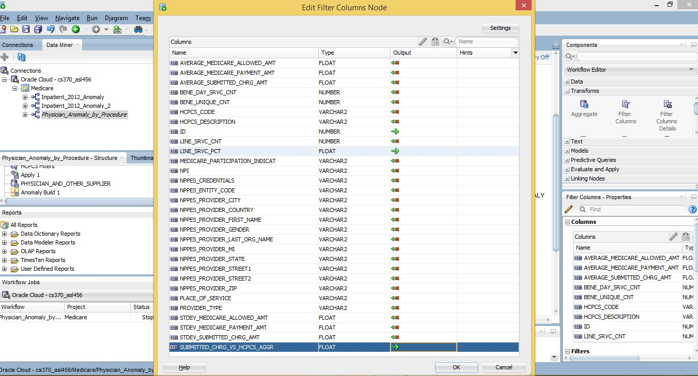
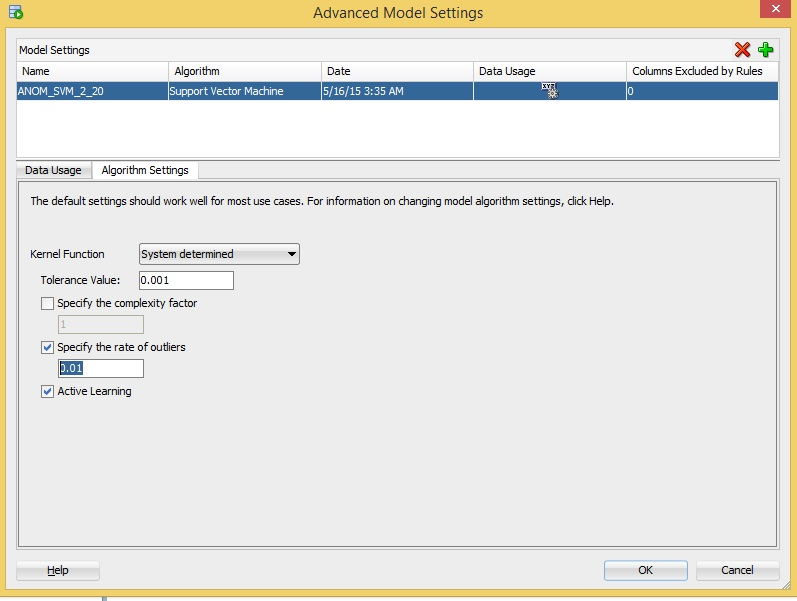
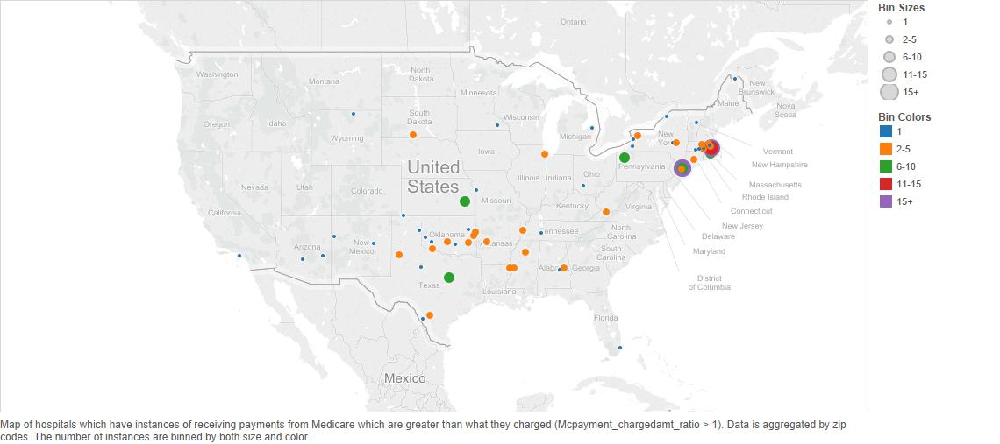

#Introduction

The [Centers for Medicare & Medicaid Services](http://www.cms.gov/) has published several datasets that contain information regarding the procedures and services that Medicare benificiaries receive from various healthcare providers. 

These datasets are divided by into three main categories, according to the type of healthcare provider:
<ul>
  <li>[Physician and Other Supplier](http://www.cms.gov/Research-Statistics-Data-and-Systems/Statistics-Trends-and-Reports/Medicare-Provider-Charge-Data/Physician-and-Other-Supplier.html) (this is by far the largest dataset, with the main database containing over 9 million records)</li>

  <li>[Inpatient](http://www.cms.gov/Research-Statistics-Data-and-Systems/Statistics-Trends-and-Reports/Medicare-Provider-Charge-Data/Inpatient.html)</li>

  <li>[Outpatient](http://www.cms.gov/Research-Statistics-Data-and-Systems/Statistics-Trends-and-Reports/Medicare-Provider-Charge-Data/Outpatient.html)</li>
</ul>

Generally speaking, all these databases are organized as follows:
<ul>
  <li>Name of the healthcare provider (hospital name, physician name, etc.)</li>

  <li>Geographic information on the healthcare provider</li>

  <li>Procedure/service provided to the Medicare beneficiary</li>

  <li>Provider's average charge for this particular type of service</li>

  <li>Medicare's average payment for this particular type of service</li>
</ul>

#Purpose

The purpose of this research is to analyze anomalous payment information in these datasets. 

According to [the Economist](http://www.economist.com/news/united-states/21603078-why-thieves-love-americas-health-care-system-272-billion-swindle), Medicare fraud adds about "$98 billion, or roughly 10%, to annual Medicare and Medicaid spending". The purpose of this research is to develop a set of models that can be run on these datasets and point out anomalous data points for the purposes of fraud detection. Ideally, these anomaly detection models can be applied to future releases of Medicare datasets as well.

#Physician and Other Supplier Databases

The Physician and Other Supplier databases contain Medicare information on physicians and other healthcare providers, along with the procedures they offered during the year 2012.

<blockquote cite = "http://www.cms.gov/Research-Statistics-Data-and-Systems/Statistics-Trends-and-Reports/Medicare-Provider-Charge-Data/Physician-and-Other-Supplier.html">The Physician and Other Supplier PUF contains information on utilization, payment (allowed amount and Medicare payment), and submitted charges organized by National Provider Identifier (NPI), Healthcare Common Procedure Coding System (HCPCS) code, and place of service. This PUF is based on information from CMS's National Claims History Standard Analytic Files. The data in the Physician and Other Supplier PUF covers calendar year 2012 and contains 100% final-action physician/supplier Part B non-institutional line items for the Medicare fee-for-service population.
</blockquote>

##Importing and Preprocessing the Databases
There are 2 databases related to Physician and Other Supplier Medicare data that we will be using. Below are detailed instructions for importing and preprocessing the databases into Oracle SQL Developer.

###1. PHYSICIAN_AND_OTHER_SUPPLIER
This is the primary database related to Physician and Other Supplier information. As a warning, this database contains over 9 million records, and is stored in a 1.7 GB .txt file. Importing this database can take up to several hours, so be sure to have a stable Internet connection.

To download this database, click on the following [link](http://www.cms.gov/apps/ama/license-2011.asp?file=http://download.cms.gov/Research-Statistics-Data-and-Systems/Statistics-Trends-and-Reports/Medicare-Provider-Charge-Data/Downloads/Medicare-Physician-and-Other-Supplier-PUF-CY2012.zip), and click "Accept". If this does not work, go to http://www.cms.gov/Research-Statistics-Data-and-Systems/Statistics-Trends-and-Reports/Medicare-Provider-Charge-Data/Physician-and-Other-Supplier.html and click on the link that says "Medicare Physician and Other Supplier PUF, CY2012, Tab Delimited format". 

Extract the contents of the .zip file. The "Medicare-Physician-and-Other-Supplier-PUF-Methodology.pdf" document contains more detailed information on this database and the methodology used to aggregate the data. Rename the extension of the "Medicare-Physician-and-Other-Supplier-PUF-CY2012.txt" to  "Medicare-Physician-and-Other-Supplier-PUF-CY2012.csv". This will allow the text file to be in a format that can be imported into your Oracle database.

Now, open up Oracle SQL Developer and connect. Go to the directory sql/ddl/ and open the "PHYSICIAN_AND_OTHER_SUPPLIER_B.sql" DDL script, and run it in Oracle. This will create a table called PHYSICIAN_AND_OTHER_SUPPLIER_B. Find that table in your connection, right click, and click on "Import Data" as seen in the screenshot below. 

Find and open "Medicare-Physician-and-Other-Supplier-PUF-CY2012.csv". The Data Import Wizard window will come up. Set Format to "delimited" and set Delimiter to "tab". Click Next.

Click Next until you get to Step 4 of 5, and then set Match By to "Position". Click Next once more, and then click Finish.

We will add some columns to this table later, but first we must import 1 more database.

###2. PHYSICIAN_HCPCS_AGGREGATE
To download this database, click on the following [link](http://www.cms.gov/apps/ama/license-2011.asp?file=http://download.cms.gov/Research-Statistics-Data-and-Systems/Statistics-Trends-and-Reports/Medicare-Provider-Charge-Data/Downloads/Medicare-National-and-State-HCPCS-Aggregate-CY2012.zip), and click "Accept". If this does not work, go to http://www.cms.gov/Research-Statistics-Data-and-Systems/Statistics-Trends-and-Reports/Medicare-Provider-Charge-Data/Physician-and-Other-Supplier.html and click on the link that says "Medicare National and State/HCPCS Aggregate table, CY2012, Microsoft Excel (.xlsx)".

Extract the contents of the .zip file. Open the "Medicare-National-and-State-HCPCS-Aggregate-CY2012.xlsx" Excel file. Go to the third page called "data", select the first row and delete it.

Now, it is possible that Oracle can import this Excel file as is, but Oracle SQL Developer was only able to import csv files on the computer that this research was conducted on. So, additional preprocessing is required. 

First, highlight columns E-H and click Format Cells. For Category, select "Number". Uncheck the box that says "Use 1000 Separator (,)". Select the top row for the section that says "Negative numbers:". Click OK. Use the screenshot below if necessary.

Now, select columns I-AC (all the columns with '$' signs), and go to Format Cells. Select "Number" for Category, and uncheck the box that says "Use 1000 Separator (,)", as shown in the screenshot below. Click OK and save the file.

Make sure that you are still on the "data" page in the Excel workbook, and click Save As, and save this file as a .csv file. There will be 2 messages that come up. Click 'OK' then click 'Yes'. You can ignore the second warning message because the data does not get corrupted.

Now that we have our .csv file, we can import the data into Oracle. Go to the directory sql/ddl/ and open the "PHYSICIAN_HCPCS_AGGREGATE.sql" DDL script, and run it in Oracle. This will create the PHYSICIAN_HCPCS_AGGREGATE table. Right click on this table in Oracle and select Import, as you did in the previous section. Find and open the .csv file that you just created. When the Data Import Wizard window comes up, you can keep clicking Next, and then Finish. You don't need to change any settings here.

After the table has finished importing, go to the directory sql/ and open the "state abbrev.sql" SQL script, and run that in Oracle as well. This will change the NPPES_PROVIDER_STATE_DESC column in PHYSICIAN_HCPCS_AGGREGATE to be state abbreviations instead of the full name of the state (i.e. 'Texas' becomes 'TX'), so that it matches up with the PHYSICIAN_AND_OTHER_SUPPLIER table. 

###Adding Calculated Columns to PHYSICIAN_AND_OTHER_SUPPLIER

This section shows how to add the BENE_DAY_SRVC_PCT and SUBMITTED_CHRG_VS_HCPCS_AGGR columns to what will ultimately be the PHYSICIAN_AND_OTHER_SUPPLIER database. This involves some complicated SQL queries, and there is no easy way to do this except for creating and dropping two more tables.

So run the following SQL scripts in succession:
<ol>
  <li>sql/ddl/PHYSICIAN_AND_OTHER_SUPPLIER_C.sql</li>
  <li>sql/physicians - bene_day_srvc_pct.sql</li>
  <li>sql/ddl/PHYSICIAN_AND_OTHER_SUPPLIER.sql</li>
  <li>sql/physicians - submitted_chrg_vs_hcpcs_aggr.sql</li>
</ol>

Finally, we have our 2 final databases pertaining to physician data, PHYSICIAN_AND_OTHER_SUPPLIER and PHYSICIAN_HCPCS_AGGREGATE.

##Physician Tables Column Descriptions

###PHYSICIAN_AND_OTHER_SUPPLIER
The following descriptions are taken from Medicare-Physician-and-Other-Supplier-PUF-Methodology.pdf (except for the last 2 columns, which were manually added). 

This database consists of the following columns:
<ul>
  <li>ID - Unique Row ID
  <li>NPI - National Provider Identifier (NPI) for the performing provider on the claim.
  <li>NPPES_PROVIDER_LAST_ORG_NAME- When the provider is registered in NPPES as an individual (entity type code='I'), this is the provider's last name. When the provider is registered as an organization (entity type code = 'O'), this is the organization name.
  <li>NPPES_PROVIDER_FIRST_NAME- When the provider is registered in NPPES as an individual (entity type code='I'), this is the provider's first name. When the provider is registered as an organization (entity type code = 'O'), this will be blank.
  <li>NPPES_PROVIDER_MI- When the provider is registered in NPPES as an individual (entity type code='I'), this is the provider's middle initial. When the provider is registered as an organization (entity type code = 'O'), this will be blank.
  <li>NPPES_CREDENTIALS- When the provider is registered in NPPES as an individual (entity type code='I'), these are the provider's credentials. When the provider is registered as an organization (entity type code = 'O'), this will be blank.
  <li>NPPES_PROVIDER_GENDER- When the provider is registered in NPPES as an individual (entity type code='I'), this is the provider's gender. When the provider is registered as an organization (entity type code = 'O'), this will be blank.
  <li>NPPES_ENTITY_CODE- Type of entity reported in NPPES. An entity code of 'I' identifies providers registered as individuals and an entity type code of 'O' identifies providers registered as organizations.
  <li>NPPES_PROVIDER_STREET1 - The first line of the provider's street address, as reported in NPPES.
  <li>NPPES_PROVIDER_STREET2 - The second line of the provider's street address, as reported in NPPES.
  <li>NPPES_PROVIDER_CITY - The city where the provider is located, as reported in NPPES.
  <li>NPPES_PROVIDER_ZIP - The provider's zip code, as reported in NPPES.
  <li>NPPES_PROVIDER_STATE - The state where the provider is located, as reported in NPPES. The fifty U.S. states and the District of Columbia are reported by the state postal abbreviation. The following values are used for other areas:
  <ul>
    <li>XX = Unknown
    <li>AA = Armed Forces Central/South America
    <li>AE = Armed Forces Europe
    <li>AP = Armed Forces Pacific
    <li>AS = American Samoa
    <li>GU = Guam
    <li>MP = North Mariana Islands
    <li>PR = Puerto Rico
    <li>VI = Virgin Islands
    <li>ZZ = Foreign Country
  </ul>
  <li>NPPES_PROVIDER_COUNTRY - The country where the provider is located, as reported in NPPES. The country code will be 'US' for any state or U.S possession. For foreign countries (i.e., state values of 'ZZ'), the provider country values include the following:
  <ul>
    <li>AE = United Arab Emirates
    <li>AR = Argentina
    <li>AU = Australia
    <li>BR = Brazil
    <li>CA = Canada
    <li>CH = Switzerland
    <li>CN = China
    <li>CO = Colombia
    <li>DE = Germany
    <li>ES = Spain
    <li>FR = France
    <li>GB = Great Britain
    <li>HU = Hungary
    <li>IL = Israel
    <li>IN = India
    <li>IS = Iceland
    <li>IT = Italy
    <li>JP = Japan
    <li>KR = Korea
    <li>NL = Netherlands
    <li>PK = Pakistan
    <li>SA = Saudi Arabia
    <li>SY = Syria
    <li>TR = Turkey
    <li>VE = Venezuela
  </ul>
  <li>PROVIDER_TYPE - Derived from the provider specialty code reported on the claim. For providers that reported more than one specialty code on their claims, this is the specialty code associated with the largest number of services.
  <li>MEDICARE_PARTICIPATION_INDICAT - Identifies whether the provider participates in Medicare and/or accepts assignment of Medicare allowed amounts. The value will be 'Y' for any provider that had at least one claim identifying the provider as participating in Medicare or accepting assignment of Medicare allowed amounts.
  <li>PLACE_OF_SERVICE - Identifies whether the place of service submitted on the claims is a facility (value of 'F') or non-facility (value of 'O'). Non-facility is generally an office setting; however other entities are included in non-facility.
  <li>HCPCS_CODE - HCPCS code for the specific medical service furnished by the provider.
  <li>HCPCS_DESCRIPTION - Description of the HCPCS code for the specific medical service furnished by the provider.
  <li>LINE_SRVC_CNT - Number of services provided; note that the metrics used to count the number provided can vary from service to service.
  <li>BENE_UNIQUE_CNT - Number of distinct Medicare beneficiaries receiving the service.
  <li>BENE_DAY_SRVC_CNT - Number of distinct Medicare beneficiary/per day services. Since a given beneficiary may receive multiple services of the same type (e.g., single vs. multiple cardiac stents) on a single day, this metric removes double-counting from the line service count to identify whether a unique service occurred.
  <li>AVERAGE_MEDICARE_ALLOWED_AMT - Average of the Medicare allowed amount for the service; this figure is the sum of the amount Medicare pays, the deductible and coinsurance amounts that the beneficiary is responsible for paying, and any amounts that a third party is responsible for paying.
  <li>STDEV_MEDICARE_ALLOWED_AMT - Standard deviation of the Medicare allowed amounts. The standard deviation indicates the amount of variation from the average Medicare allowed amount that exists within a single provider, HCPCS service, and place of service.
  <li>AVERAGE_SUBMITTED_CHRG_AMT - Average of the charges that the provider submitted for the service.
  <li>STDEV_SUBMITTED_CHRG_AMT - Standard deviation of the charge amounts submitted by the provider. The standard deviation indicates the amount of variation from the average submitted charge amount that exists within a single provider, HCPCS service, and place of service.
  <li>AVERAGE_MEDICARE_PAYMENT_AMT - Average amount that Medicare paid after deductible and coinsurance amounts have been deducted for the line item service.
  <li>STDEV_MEDICARE_PAYMENT_AMT - Standard deviation of the Medicare payment amount. The standard deviation indicates the amount of variation from the average Medicare payment amount that exists within a single provider, HCPCS service, and place of service.
  <li>BENE_DAY_SRVC_PCT - The percentage of distinct Medicare beneficiary per day services that the provider conducted for this particular HCPCS service out of all beneficiary per day services for this particular HCPCS service. This is one of the calculated columns that was added to the table to check for outliers. If this value is high, that means that the provider did this HCPCS procedure in a much higher proportion relative to other providers.
  <li>SUBMITTED_CHRG_VS_HCPCS_AGGR - The ratio of the submitted charge for this HCPCS procedure to the average amount charged for this HCPCS procedure aggregated by state, so as to adjust for cost of living differences. Ideally, this value should be close to 1. If the ratio is much greater than 1, then this provider could be overbilling for this procedure compared to other providers in the same area.
</ul>

###PHYSICIAN_HCPCS_AGGREGATE
The following descriptions are taken from Medicare-National-and-State-HCPCS-Aggregate-CY2012.xlsx on page 2 (Documentation).

This database consists of the following columns:
<ul>
  <li>NPPES_PROVIDER_STATE_DESC -  The state where the provider is located, as reported in NPPES. The values include the 50 United States, District of Columbia, U.S. territories, Armed Forces areas, Unknown and Foreign Country.
  <li>HCPCS_CODE - HCPCS code for the specific medical service furnished by the provider.
  <li>HCPCS_DESCRIPTION - Description of the HCPCS code for the specific medical service furnished by the provider.
  <li>PLACE_OF_SERVICE - Identifies whether the place of service submitted on the claims is a facility (value of 'F') or non-facility (value of 'O').  Non-facility is generally an office setting; however other entities are included in non-facility. 
  <li>NUMBER_OF_PROVIDERS - Number of providers within state, hcpcs code and place of service.
  <li>LINE_SRVC_CNT - Number of services provided; note that the metrics used to count the number provided can vary from service to service.
  <li>UNIQUE_BENE_DOCTOR_CNT - Number of unique beneficiary/doctor interactions (e.g., if a single beneficiary sees two different doctors for a given HCPCS code this value would be two).  
  <li>BENE_DAY_SRVC_CNT - Number of distinct Medicare beneficiary/per day services. Since a given beneficiary may receive multiple services of the same type (e.g., single vs. multiple cardiac stents) on a single day, this metric removes double-counting from the line service count to identify whether a unique service occurred. 
  <li>AVERAGE_MEDICARE_ALLOWED_AMT - Average of the Medicare allowed amount for the service. Medicare allowed amounts includes the amount Medicare pays, the deductible and coinsurance amounts that the beneficiary is responsible for paying, and any amounts that a third party is responsible for paying.
  <li>MIN_MEDICARE_ALLOWED_AMT - The minimum Medicare allowed amount for the service.
  <li>P25_MEDICARE_ALLOWED_AMT - The 25th percentile Medicare allowed amount for the service.
  <li>P50_MEDICARE_ALLOWED_AMT - The median (50th percentile) Medicare allowed amount for the service.
  <li>P75_MEDICARE_ALLOWED_AMT - The 75th percentile Medicare allowed amount for the service.
  <li>MAX_MEDICARE_ALLOWED_AMT - The maximum Medicare allowed amount for the service.
  <li>STD_MEDICARE_ALLOWED_AMT - Standard deviation of the Medicare allowed amount. The standard deviation indicates the amount of variation from the average Medicare allowed amount that exists within state, HCPCS service, and place of service.
  <li>AVERAGE_SUBMITTED_CHRG_AMT - Average of the charges that providers submit for the service.
  <li>MIN_SUBMITTED_CHRG_AMT - The minimum submitted charges for the service.
  <li>P25_SUBMITTED_CHRG_AMT - The 25th percentile of submitted charges for the service.
  <li>P50_SUBMITTED_CHRG_AMT - The median (50th percentile) of submitted charges for the service.
  <li>P75_SUBMITTED_CHRG_AMT - The 75th percentile of submitted charges for the service.
  <li>MAX_SUBMITTED_CHRG_AMT - The maximum submitted charge for the service.
  <li>STD_SUBMITTED_CHRG_AMT - Standard deviation of the charge amounts submitted by providers. The standard deviation indicates the amount of variation from the average submitted charge amount that exists within state, HCPCS service, and place of service.
  <li>AVERAGE_MEDICARE_PAYMENT_AMT - Average amount that Medicare paid after deductible and coinsurance amounts have been deducted for the line item service.
  <li>MIN_MEDICARE_PAYMENT_AMT - The minimum Medicare payment amount for the service.
  <li>P25_MEDICARE_PAYMENT_AMT - The 25th percentile Medicare payment amount for the service.
  <li>P50_MEDICARE_PAYMENT_AMT - The median (50th percentile) Medicare payment amount for the service.
  <li>P75_MEDICARE_PAYMENT_AMT - The 75th percentile Medicare payment amount for the service.
  <li>MAX_MEDICARE_PAYMENT_AMT - The maximum Medicare payment amount for the service.
  <li>STD_MEDICARE_PAYMENT_AMT - Standard deviation of the Medicare payment amount. The standard deviation indicates the amount of variation from the average Medicare payment amount that exists within state, HCPCS service, and place of service.

##Anomaly Detection Model

The first point of interest is to determine whether Medicare is consistent with how they reimburse healthcare providers. In order to do this, we take the ratio of the amount Medicare pays (AVERAGE_MEDICARE_PAYMENT_AMT) to the amount allowed by Medicare for a procedure (AVERAGE_MEDICARE_ALLOWED_AMT).

As can be seen from the above figure, there is a very strong linear correlation between the Medicare paid amount and the Medicare allowed amount for each procedure, with virtually no outliers based on both the extremely low p-value as well as simple visual inspection. This indicates that Medicare is very consistent with how they reimburse healthcare providers based on the allowed amount for a particular procedure (which is based on the HCPCS code and location).

Since Medicare is very consistent with how they reimburse providers, it is possible that a healthcare provider will purposely bill Medicare for procedures that are known to be expensive. Also, it's possible that a healthcare provider can commit fraud by billing Medicare a much higher amount compared to other providers conducting the same procedure in the same geographic area (aggregated by state in our databases).

###Physician Anomaly Workflow

This section describe the workflow that was used for anomaly detection. Below is a screenshot of the entire workflow.

The data source is the PHYSICIAN_AND_OTHER_SUPPLIER_TABLE. Next, is a Filter Rows node called "50 States + DC", which will filter out U.S. territories (Guam, Puerto Rico) because those contain too few data points to be useful. The filter can be replicated by copying the below text:
<blockquote>
"NPPES_PROVIDER_STATE"  != 'XX'  Or
"NPPES_PROVIDER_STATE"  != 'AA'  Or
"NPPES_PROVIDER_STATE"  != 'AE'  Or
"NPPES_PROVIDER_STATE"  != 'AP'  Or
"NPPES_PROVIDER_STATE"  != 'AS'  Or
"NPPES_PROVIDER_STATE"  != 'GU'  Or
"NPPES_PROVIDER_STATE"  != 'MP'  Or
"NPPES_PROVIDER_STATE"  != 'PR'  Or
"NPPES_PROVIDER_STATE"  != 'VI'  Or
"NPPES_PROVIDER_STATE"  != 'ZZ'
</blockquote>

After that, there is another Filter Rows node called "HCPCS Filters", which will filter out procedures that have were conducted by at least 100 providers and had a median Medicare Allowed Amount of $1000. Recall the linear relationship between Medicare Payment and Medicare Allowed Amount. The reason Medicare Allowed Amount is chosen for the filter is because it is extremely predictable. A healthcare provider that is potentially committing fraud is going to bill Medicare for procedures that are known to have a high Medicare Allowed Amount. This node can be re-created by copying the text from hcpcs_filter.txt in the HCPCS_Filter/ directory.

####Customizing Filter for HCPCS Codes

Read this section ONLY if you wish to change the parameters for filtering out certain procedures. As mentioned in the previous section, the filter is set for procedures that have a median Medicare allowed amount of at least $1000 and were conducted by at least 100 providers. Otherwise, skip to the next section to continue reading about the anomaly detection workflow.

First, go to the sql/ directory and run "hcpcs filters.sql". This will print out a list of HCPCS Codes that match with at least 100 providers and have a median Medicare Allowed Payment Amount that is at least $1000. Basically, this query is filtering out the most expensive procedures that were still conducted by enough providers so as not to end up with false positives in the anomaly detection. You can change these parameters in the SQL script as desired. If you do change the parameters, copy and paste the output into a .txt file.

Next, go to the HCPCS_Filter/src directory and open FilterHCPCS.java. Make sure to change the input path in line 17 to be the .txt file that you just created. Set the output path in line 19 to wherever you want. Compile and run the program. Copy and paste the text in the output file from the path that you specified into the "HCPCS Filters" node in the Physician Anomaly workflow.
********************************************************************************

For the Filter Columns node, the below setting were used. 

This is where the importance of the two calculated columns, BENE_DAY_SRVC_PCT and SUBMITTED_CHRG_VS_HCPCS_AGGR comes into play. These are the two main attributes used by the Anomaly Detection node. The NPPES geographic information is filtered out because the state has already been accounted for in SUBMITTED_CHRG_VS_HCPCS_AGGR. The rest of the geographic information and other columns that were filtered out cause too much noise, and throw off the anomaly detection.

For the Anomaly Detection node, Case ID is set to "ID". Also, the outlier rate should was changed to 0.01 in Advanced Settings as seen below. The original setting of 0.10 is far too high.

In the Apply node, all the columns from the source table were added in the Additional Output tab. Finally, this was exported into the table called PHYSICIAN_ANOMALY, which holds the results of this particular anomaly detection model.

##Anomaly Detection Results

Before showing the results, it is important to understand the two columns BENE_DAY_SRVC_PCT and SUBMITTED_CHRG_VS_HCPCS_AGGR. Also, keep in mind that this database aggregated by provider (NPI), HCPCS code (procedure), and place of service (facility or non-facility). This will help in understanding the methodology for these two columns.

###BENE_DAY_SRVC_PCT - Beneficiary Per Day Services Percentage
For a given type of procedure and place of service, this is the percentage of all procedures that one provider conducted. For example, suppose that we wish to look at HCPCS Code 93010 (Electrocardiogram report) in a non-facility ('O'). Assume that in there were a total of 1000 beneficiary per day services (basically, the number of procedures). Now assume that a provider with NPI (identification number) 1003000522 conducted 100 beneficiary per day services for this particular procedure in a non-facility. Then, the BENE_DAY_SRVC_PCT for this particular record will be 100/1000 = 10%. 
Anytime, the BENE_DAY_SRVC_PCT for a certain procedure is unusually high, it will be flagged as an anomaly because it means that this provider conducted an usually high amount of services for this procedure relative to other providers. This does not necessarily mean that it is a case of fraud; it could just be an unusually large practice that sees lots of patients. However, it is worth inspecting, because the provider could billing Medicare for this procedure when it is not necessary because it is known to have a high reimbursement.

###SUBMITTED_CHRG_VS_HCPCS_AGGR - Provider Submitted Charge vs HCPCS Aggregated Submitted Charge
For a given procedure and place of service, this is the ratio of the Medicare submitted charge from one provider versus the median submitted charge for all providers in that same state that conducted this same procedure. Basically, it is designed to tell us whether a provider is overbilling (or underbilling) for a procedure relative to other providers.
For example, suppose provider 1003000522 charged Medicare $1000 for HCPCS Code 93010 (Electrocardiogram report) in a non-facility ('O') setting. Assume that he is based in Florida. Also, assume that for all providers in Florida that conducted this same procedure in a non-facility setting, their median submitted charge to Medicare was $100. Then, the SUBMITTED_CHRG_VS_HCPCS_AGGR for this particular record will be $1000/$100 = 10.
To adjust for cost of living differences across the United States, this column was aggregated by state. 

###Results in Tableau

The following graphs display BENE_DAY_SRVC_PCT along the x-axis and SUBMITTED_CHRG_VS_HCPCS_AGGR along the y-axis. The anomaly predictions ('0' for anomaly, '1' for normal) are color coded. So anything that is high up on either axis should be flagged as an outlier and merits inspection.

The below graph maps out every record that was in PHYSICIAN_ANOMALY. As mentioned previously, it contains records for HCPCS Code-Place of Service combinations that matched up with more than 100 providers and had a Medicare allowed payment amount of at least $1000. Some of the NPI labels can be seen. This is from page 2 in Physicians.twb in the Tableau/ directory.

The above graph is meant just to illustrate the general distribution of results. Below are several graphs that show results for specific procedures according to the HCPCS code and place of service. Only the procedures containing significant outliers are displayed. These visualizations are from page 3 in Physicians.twb in the Tableau/ directory. The NPI and state are labeled next to some of the outlying points

There are a total of 77 different graphs, but these were the ones with the most notable outliers. The first two graphs show providers that charge an unusually high amount for a procedure, and the last four show providers that conduct an unusually high number of a certain type of procedure. At this point, this is all the information that can be gleaned from public records. We have developed the model for finding anomalous data points. 
However, more information would be needed to actually check why these providers show up as anomalous, such as financial documents for the individual providers. Unfortunately, that information is not available to the public at this point. So, while these data points are anomalous and merit inspection, it would be premature to say that they are definitely cases of fraud. As stated in the purpose statement, this goal of this project is to develop a model for pointing anomalies that could then be analyzed and audited by an agency such as the CMS or the OIG (https://oig.hhs.gov/fraud/strike-force/). 

##Inpatient Databases

These databases contain Medicare information on inpatient providers and the procedures that they offered within a fiscal year period.

<blockquote cite="http://www.cms.gov/Research-Statistics-Data-and-Systems/Statistics-Trends-and-Reports/Medicare-Provider-Charge-Data/Inpatient.html">
The Inpatient PUF contains hospital-specific charges for the more than 3,000 U.S. hospitals that receive Medicare Inpatient Prospective Payment System (IPPS) payments for the top 100 most frequently billed discharges, paid under Medicare based on a rate per discharge using the Medicare Severity Diagnosis Related Group (MS-DRG). This PUF is based on information from CMS's Medicare Provider Analysis and Review (MEDPAR) inpatient data. The data in the Inpatient PUF contains 100% final-action (i.e., all claim adjustments have been resolved) IPPS discharges for the Medicare fee-for-service (FFS) population. The Inpatient PUF is available for calendar years 2011 and 2012.
</blockquote>

There are a total of 6 databases related to Inpatient Medicare data:
<ul>
  <li>INPATIENT_2011_DATA - Aggregated by individual healthcare providers and MS-DRG for 2011
  <li>INPATIENT_2011_NATIONAL_DATA - Aggregated by state and MS-DRG for 2011
  <li>INPATIENT_2011_STATE_DATA - Aggregated by MS-DRG for 2011
  <li>INPATIENT_2012_DATA - Aggregated by individual healthcare providers and MS-DRG for 2012
  <li>INPATIENT_2012_NATIONAL_DATA - Aggregated by state and MS-DRG for 2012
  <li>INPATIENT_2012_STATE_DATA - Aggregated by MS-DRG for 2012
</ul>

###INPATIENT_2012_DATA
This database consists of the following columns:
<ul>
  <li>ID - Unique Row ID
  <li>DRG_DEFINITION - The code and description identifying the MS-DRG. MS-DRGs are a classification system that groups similar clinical conditions (diagnoses) and the procedures furnished by the hospital during the stay.
  <li>PROVIDER_ID - The provider identifier assigned to the Medicare certified hospital facility.
  <li>PROVIDER_NAME - The name of the provider.
  <li>PROVIDER_STREET_ADDRESS - The provider's street address.
  <li>PROVIDER_CITY - The city where the provider is located.
  <li>PROVIDER_STATE - The state where the provider is located.
  <li>PROVIDER_ZIP_CODE - The provider's zip code.
  <li>HRR_DESCRIPTION - The Hospital Referral Region (HRR) where the provider is located.
  <li>TOTAL_DISCHARGES - The number of discharges billed by the provider for inpatient hospital services.
  <li>AVERAGE_COVERED_CHARGES - The provider's average charge for services covered by Medicare for all discharges in the DRG. These will vary from hospital to hospital because of differences in hospital charge structures.
  <li>AVERAGE_TOTAL_PAYMENTS - The average total payments to all providers for the MS-DRG including the MS-DRG amount, teaching, disproportionate share, capital, and outlier payments for all cases. Also included in average total payments are co-payment and deductible amounts that the patient is responsible for and any additional payments by third parties for coordination of benefits.
  <li>AVERAGE_MEDICARE_PAYMENTS - The average amount that Medicare pays to the provider for Medicare's share of the MS-DRG. Average Medicare payment amounts include the MS-DRG amount, teaching, disproportionate share, capital, and outlier payments for all cases. Medicare payments DO NOT include beneficiary co-payments and deductible amounts nor any additional payments from third parties for coordination of benefits.
  <li>MCPAYMENT_CHARGEDAMT_RATIO - Ratio of Medicare payment(AVERAGE_MEDICARE_PAYMENTS) to the amount charged by the provider (AVERAGE_COVERED_CHARGES)
  <li>MCPAYMENT_CHARGE_RATIO_LEVEL - Description of MCPAYMENT_CHARGEDAMT_RATIO. Falls into one of 3 categories:
  <ul>
    <li>Less than 25%
    <li>Between 25% and 50%
    <li>Greater than 50%
  </ul>
  <li>TOT_PAYMENT_CHARGEDAMT_RATIO - Ratio of Total payment(AVERAGE_TOTAL_PAYMENTS) to the amount charged by the provider (AVERAGE_COVERED_CHARGES)
  <li>TOTPAYMENT_CHARGE_RATIO_LVL - Description of TOT_PAYMENT_CHARGEDAMT_RATIO. Falls into one of 3 categories:
  <ul>
    <li>Less than 25%
    <li>Between 25% and 50%
    <li>Greater than 50%
  </ul>
  <li>MCPAYMENT_TOTALPAY_RATIO - Ratio of Medicare payment(AVERAGE_MEDICARE_PAYMENTS) to total payment (AVERAGE_COVERED_CHARGES)
  <li>MCPAY_TOTPAYMENT_RATIO_LVL - Description of the ratio of Medicare payment to the amount charged by the provider. Falls into one of 3 categories:
  <ul>
    <li>Less than 80%
    <li>Between 80% and 90%
    <li>Greater than 90%
  </ul>
</ul>

###Inpatient Anomaly Detection

####Medicare Payment Versus Provider Charge Anomalies

The Inpatient 2011 and 2012 databases were the only ones from the entire Medicare data set in which there were instances of Medicare paying more than what a provider charged them. This is very unusual because Medicare will almost always reimburse providers less than what the provider charged. 

First let us look at the overall distribution of Medicare Payment to Charged Amount ratios across the entire database.

We can clearly see just how anomalous it is for the ratio be greater than 1. In fact, there were 340 cases in which this occurred out of a total of 157747 (roughly 0.22%).

In order to analyze this further, the distribution of these anomalies was examined on a geographics level.

The above two figures display the geographic distribution of these particular anomalies. We can see that New York City and Boston have the most amount of procedures where Medicare overpaid.

